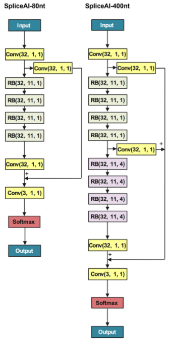
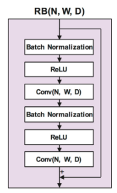

# DNA Splice Site Prediction
Project 2 of the course Machine Learning for Health Care in FS21 at ETH Zürich


## Objective
This project is a binary classification task. As an input, we are given DNA sequences and for each, we need to classify whether the middle of the sequence is representing an acceptor site (1) or is not an acceptor site (-1). In order to make the predictions, we need to take the imbalance of the datasets into account and explore a variety of models (with different classifiers, sequence encodings, etc.).

## SpliceAI
Among various other models, we make use of SpliceAI [1] and its deep architecture.
Splice80 and Splice400            | Residual Block
:-------------------------:|:-------------------------:
 | 


## Submission Files
The trained models specified in the report and their predictions files for the Human and C.elegans test sequence datasets can be found on GitLab via the following link: [GitLab](https://gitlab.ethz.ch/manstude/ml4h_project_2).

## Setup

### Installation
Clone this repository.
```bash
$ git clone https://github.com/fanconic/ML4H_project2.git
$ cd ML4H_project2
```

We suggest to create a virtual environment and install the required packages.
```bash
$ conda create -n test_env
$ conda activate test_env
$ pip3 install -r requirements.txt
```

### Dataset
The datasets have been provided to us via Moodle and is not publicly available. If you anyway would be interested in using it, please reach out to us in order to check if handing the data to you would be possible. The datasets originated from C. elegans (roundworm) and humans.

### Repository Structure
```
 .
 ├── src                 # Source code for the experiments
    ├── data                # Data loaders, preprocessing, helper functions
    ├── models              # All models used for our project   (incl. SpliceAI)
    └── utils               # Additional helper functions (e.g. model saver and loader)
(├── exercise_data)      # Splice Site Data (not in repository - insert here) 
(├── saved_outputs)      # Prediction results (not in repository - created upon first run)
(├── saved_models)       # Saved models (not in repository - created upon first run)
 └── misc                # Training logs and images
```

### Relevant Files Overview

- `train.py`: train all the traditional models
- `predict.py`: create predictions with all the traditional models
- `cross_validation.py`: cross validate the traditional models
- `train_spliceAI.py`: train SpliceAI80 and SpliceAI400
- `predict_spliceAI.py`: create predictions with SpliceAI80 and SpliceAI400
- `settings.py`: Settings for paths, hyperparameters and variables (choose here 'humans' or 'celegans' sequences)
- `generate_output.py`: Generate the output in .csv format
- `calculate_auprc_auroc.py`: Calculates the AUPRC and AUROC for every model from the saved predictions
- `sample_hyperparameter_tuning.py`: Sample file for hyperparameter tuning
- `run.sh`: Script to train and predict the traditional models on Leonhard
- `run_spliceAI.sh`: Script to train and predict the SpliceAI on Leonhard


## Contributors
- Manuel Studer - manstude@ethz.ch
- Claudio Fanconi - fanconic@ethz.ch
- Severin Husmann - shusmann@ethz.ch

## References
- [1] https://www.sciencedirect.com/science/article/pii/S0092867418316295
- [2] https://www.sciencedirect.com/science/article/pii/S0092867418316295
- [3] https://www.sciencedirect.com/science/article/abs/pii/S095070511100089X

